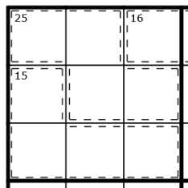

# My Personal Website

Hi, I'm Cheryl.

I'm a web dev, currently a Senior Full Stack Engineer.

This website was created to sit on my AWS account, cheaply (hosted on an S3 bucket, because I was too cheap for amplify), with a nice homepage for those who might stumble on it.

## How to run it

First, you'll need to install the packages I've used from NPM

```
npm install
```

Then you can run it with 

```
npm run dev
```

It uses vite, so it's fast!

## How to build it

Install packages (as above) if you've not yet.

Then you can build to static files with

```
npm run build
```

## Tools

I made a few handy tools for myself, but I'll let you take a look.

### Stardew Bundles

I've been learning some Japanese for a while, and to practice, I've been playing Stardew Valley in Japanese. But, even in English, I have the problem of not remembering what I need to get and what I've already got in the bundles.

This tool lists the bundles, what they contain and gives me a checklist that is stored in local storage.

### Killer Sudoku

Killer sudoku is my favourite kind of sudoku.

How to sudoku:
Normal sudoku consists of a 9x9 main grid, consisting of 9 3x3 small grids
Each small grid, row and column contain the numbers 1-9, not repeated in any grid/row/column

Normally this calls for a few prefilled cells (at least 17 cells must be filled to produce a unique solution).

Killer sudoku adds "cages", dotted lines that contain 1-9 cells and have a total, found in the top left of the cage. Numbers in cages also do not repeat.

There are limited ways to add up to each cage total, and killer sudoku books will usually have a cage reference page - I've torn mine out of the book because I find it very handy. If I'm doing killers on my PC, I'll reference https://godoku.com/play/killer/combinations/ as one of the only killer cage references online but I wanted a better option.

I wanted a full list that I can filter as needed, so that I can filter to:
* Cage total
* Number of cells in cage
* Known numbers
* Not included numbers

I'd also like a calculator built in, with custom buttons (45 / 90 / etc) specifically for killer maths (a small grid, row or column adds to 45, so a grid containing all cells for the cages 25 and 15 has 5 remaining).



Why? I'm here for puzzles, not memory games, thanks for asking. I also Google everything at work (I'm good at Google).

